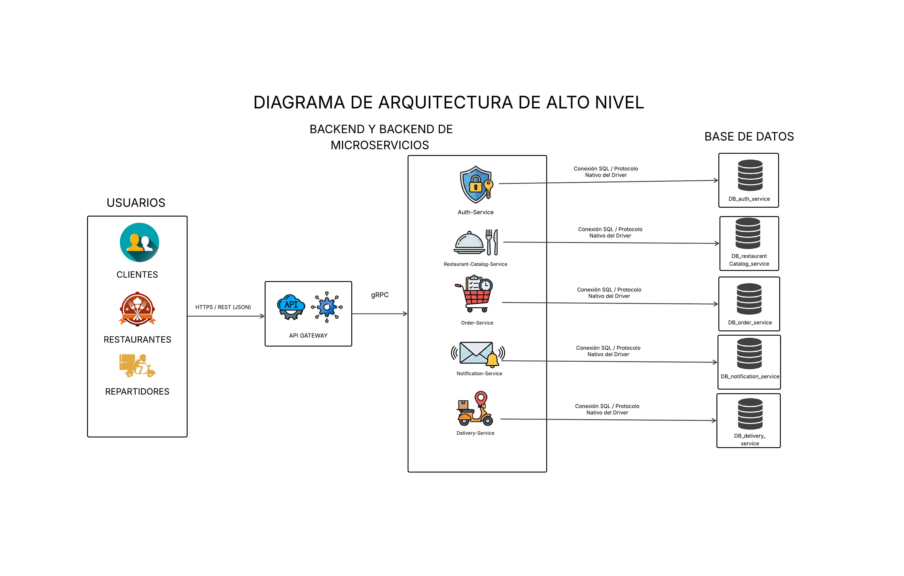
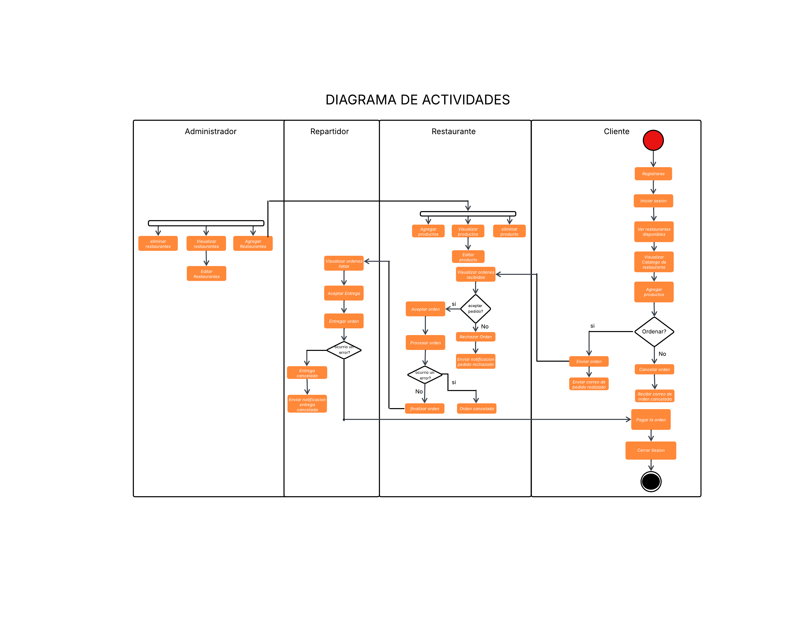
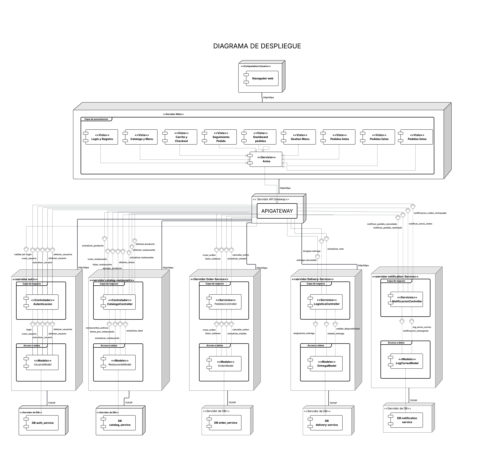

#  Universidad de San Carlos de Guatemala  
###  Facultad de Ingeniería - Escuela de Ciencias y Sistemas  
###  Software Avanzado Seccion: A

##  Nombre: **Edgar Josías Cán Ajquejay**  
##  Carnet: **202112012** 

# Requerimientos Funcionales

| ID | Requerimiento Funcional (RF) | Descripción | Prioridad |
| :--- | :--- | :--- | :--- |
| **RF-01** | **Registro de Usuarios** | El sistema debe permitir el registro de nuevos usuarios capturando email, contraseña y rol (cliente, RESTAURANTE, REPARTIDOR, ADMINISTRADOR), validando correos únicos y encriptando contraseñas. | Alta |
| **RF-02** | **Inicio de Sesión (Login)** | Los usuarios registrados deben poder autenticarse en la plataforma mediante sus credenciales (email y contraseña). | Alta |
| **RF-03** | **Generación de JWT** | El sistema debe generar un JSON Web Token tras un login exitoso, conteniendo el ID, email y rol para autorizar el acceso a los microservicios. | Alta |
| **RF-04** | **Validación de Credenciales** | El microservicio de Auth debe validar los tokens JWT enviados en las peticiones hacia otros servicios para asegurar el acceso por roles. | Alta |
| **RF-05** | **Gestión de Restaurantes (CRUD)** | El administrador debe poder crear, leer, actualizar y eliminar restaurantes, incluyendo nombre, dirección, horarios y contacto. | Alta |
| **RF-06** | **Gestión de Ítems de Menú (CRUD)** | El RESTAURANTE debe poder administrar los platos de su menú, definiendo nombre, descripción, precio y disponibilidad. | Alta |
| **RF-07** | **Listado de Restaurantes** | El cliente debe poder consultar el catálogo de restaurantes disponibles con información como nombre, tipo de comida y calificación. | Alta |
| **RF-08** | **Consulta de Menú** | El cliente debe poder visualizar el menú detallado y los precios de un restaurante seleccionado. | Alta |
| **RF-09** | **Realización de Órdenes** | El cliente debe poder generar pedidos con los productos seleccionados y enviarlos al restaurante correspondiente. | Alta |
| **RF-10** | **Cancelación de Pedido (cliente)** | El cliente debe poder cancelar su orden, actualizando automáticamente el estado a "CANCELADO" para el restaurante. | Media |
| **RF-11** | **Gestión de Estados (Restaurante)** | El RESTAURANTE debe visualizar pedidos y actualizar su estado a "EN PROCESO", "FINALIZADO" o "LISTA" según corresponda. | Alta |
| **RF-12** | **Rechazo de Órdenes** | El RESTAURANTE debe poder rechazar pedidos por falta de stock o personal, marcándolos como "RECHAZADA". | Media |
| **RF-13** | **Aceptación de Pedido (Repartidor)** | El REPARTIDOR debe poder aceptar órdenes en estado "LISTA", cambiando el estado a "EN CAMINO". | Alta |
| **RF-14** | **Actualización de Entrega** | El REPARTIDOR debe marcar el pedido como "ENTREGADO" al completarse o "CANCELADO" en caso de incidencias. | Alta |
| **RF-15** | **Notificación de Creación** | El cliente debe recibir un correo con el resumen (N° orden, productos, monto total) al momento de realizar la compra. | Media |
| **RF-16** | **Notificación de Envío** | El cliente debe ser notificado cuando su orden esté "EN CAMINO", incluyendo el nombre del repartidor asignado. | Media |
| **RF-17** | **Notificación de Cancelación** | El cliente debe recibir un correo informativo si el pedido es cancelado, indicando la razón y el estado final. | Media |
| **RF-18** | **Notificación de Rechazo** | El cliente debe recibir un correo si el restaurante rechaza la orden, detallando los productos involucrados. | Media |
| **RF-19** | **Gestión de Rutas REST** | El API Gateway debe exponer endpoints REST al frontend y gestionar el flujo de solicitudes hacia los servicios internos. | Alta |
| **RF-20** | **Comunicación interna** | El sistema debe utilizar gRPC para la comunicación de alta velocidad entre los microservicios del ecosistema. | Alta |

# Requerimientos No Funcionales

| ID | Atributo | Requerimiento No Funcional (RNF) | Prioridad |
| :--- | :--- | :--- | :--- |
| **RNF-01** | **Arquitectura** | La plataforma debe implementarse mediante una arquitectura de microservicios independientes y desacoplados. | Alta |
| **RNF-02** | **Comunicación gRPC** | La comunicación interna entre los microservicios del backend debe realizarse estrictamente mediante gRPC. | Alta |
| **RNF-03** | **Estándar REST** | El acceso externo a la plataforma por parte del frontend debe realizarse a través de una API REST centralizada en el Gateway. | Alta |
| **RNF-04** | **Contenerización** | Todos los servicios de la aplicación deben estar empaquetados en contenedores de Docker optimizados. | Alta |
| **RNF-05** | **Orquestación** | Se debe utilizar Docker Compose para coordinar y levantar todos los contenedores de la aplicación en el entorno local. | Alta |
| **RNF-06** | **Nube (GCP)** | El sistema completo debe ser desplegado y estar operativo en la infraestructura de Google Cloud Platform. | Alta |
| **RNF-07** | **Seguridad (JWT)** | El control de acceso y la protección de endpoints sensibles debe gestionarse mediante tokens JWT. | Alta |
| **RNF-08** | **Persistencia** | Cada microservicio debe tener su propia base de datos independiente para garantizar la autonomía de los datos. | Alta |
| **RNF-09** | **Escalabilidad** | El diseño debe permitir el crecimiento del sistema y la adición de nuevas funciones sin afectar los servicios base. | Media |
| **RNF-10** | **Rendimiento** | La plataforma debe asegurar tiempos de respuesta bajos y una navegación fluida para los usuarios finales. | Media |

# Diagrama de arquitectura de Alto Nivel

# Diagrama ER

# Diagrama de Actividades

# Diagrama de Despliegue

